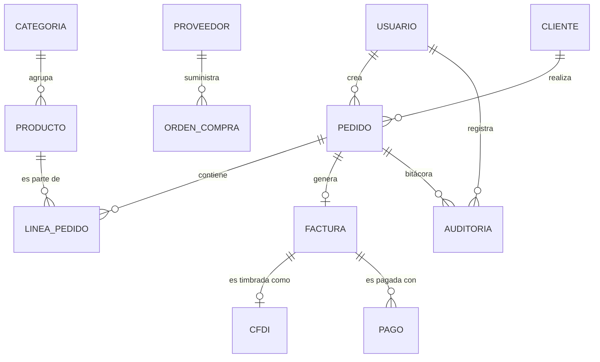

# Manual completo de Rust, MySQL y Actix Web orientado al ERP/CRM

[](https://www.rust-lang.org/)
[](https://mariadb.org/)
[](https://actix.rs/)
[](LICENSE)
[](index.md)
[](proyectos_capitulo/)
[](proyecto_api/)
[](index.md)

> **Un viaje desde cero absoluto hasta una API REST de nivel producción para un sistema ERP/CRM mexicano (RFC, CFDI 4.0, IVA, IEPS, inventarios, facturación y más).**

---

## 📚 Acerca del manual

Este repositorio contiene un **manual técnico completo en español** de Rust, MySQL/MariaDB y Actix Web, orientado a la construcción de un **ERP/CRM profesional** para el mercado mexicano. Cubre desde los conceptos más básicos del lenguaje hasta el despliegue en producción de una API REST con autenticación JWT, transacciones de base de datos, y dos ORM diferentes (Diesel y SeaORM).

El manual está diseñado para **personas sin experiencia previa en Rust**, con analogías, ejemplos paso a paso, y 18 proyectos ejecutables que crecen en complejidad de manera progresiva.

## ✨ Características

- 📖 **103 361 palabras** de contenido didáctico en español
- 🏗️ **18 proyectos Rust ejecutables** (todos compilan y pasan tests)
- 🌐 **1 API REST funcional con 18 endpoints**, autenticación JWT, transacciones
- 🗄️ **Esquema SQL completo** del ERP con 7 tablas (clientes, productos, pedidos, líneas, categorías, proveedores, usuarios)
- 🔗 **275 enlaces internos** en la tabla de contenidos para navegación instantánea
- 📊 **17 diagramas Mermaid** (ER, sequence, flowchart, gantt)
- 💻 **343 bloques de código Rust** comentados en español
- 🎯 **80+ ejercicios prácticos** con soluciones detalladas
- 📚 **212 apéndices** agrupados temáticamente (cheat sheets, casos de estudio, glosarios, reflexiones, recursos)
- 🐳 **Docker Compose** listo para producción

## 📊 Métricas del manual

| Métrica | Valor |
|---|---|
| Palabras | **103 361** |
| Líneas de Markdown | 21 337 |
| Bytes | 754 KB |
| Secciones H1 | 354 |
| Secciones H2 | 864 |
| Secciones H3 | 465 |
| Secciones H4 | 53 |
| Bloques de código Rust | 343 |
| Diagramas Mermaid | 17 |
| Enlaces internos en ToC            **275**
| Proyectos que compilan | **18/18** ✅ |
| Endpoints API | **18** |
| Ejercicios | 80+ |
| Apéndices |  212 |

## 🏛️ Estructura del proyecto

```
rust_man/
├── README.md                        ← Este archivo
├── AGENT.md                          ← System prompt del agente que generó el manual
├── requisitos_del_manual.md          ← Requisitos originales del manual
├── index.md                       <- Manual completo (103k palabras, 754KB)
├── assets/                           ← Recursos adicionales
├── proyectos_capitulo/               ← 17 mini-proyectos (Parte 1, 2, 3)
│   ├── parte1/                       ← 8 proyectos de fundamentos de Rust
│   ├── parte2/                       ← 4 proyectos de Rust + MySQL
│   ├── parte3/                       ← 5 proyectos de Actix Web + ORM
│   └── parte2/sql/                   ← init.sql compartido
└── proyecto_api/                     ← API REST final del ERP/CRM
    ├── docker-compose.yml            ← MariaDB + API Diesel + API SeaORM
    ├── sql/init.sql                   ← Esquema del ERP con datos de ejemplo
    ├── api_diesel/                    ← API con mysql crate (síncrona)
    └── api_seaorm/                    ← API con SeaORM (asíncrona, esqueleto)
```

## 🚀 Inicio rápido

### Requisitos previos

- **Rust 1.96+** ([instalar](https://rustup.rs/))
- **MariaDB 11** o **MySQL 8** ([Docker](https://www.docker.com/) o [Podman](https://podman.io/) recomendados)
- **Git**

### Instalación

```bash
# 1. Clonar el repositorio
git clone https://github.com/usuario/rust_man.git
cd rust_man

# 2. Instalar componentes adicionales de Rust
rustup component add rustfmt clippy

# 3. Iniciar MariaDB con Docker/Podman
podman run -d --name mysql_man \
  -e MYSQL_ROOT_PASSWORD=secret \
  -e MYSQL_DATABASE=erp_crm \
  -v ~/podman/mysql_data:/var/lib/mysql:Z \
  -p 127.0.0.1:3306:3306 \
  docker.io/library/mariadb:11

# 4. Cargar el esquema del ERP
mysql -h 127.0.0.1 -u root -psecret < proyecto_api/sql/init.sql

# 5. Compilar y ejecutar la API final
cd proyecto_api/api_diesel
cargo run --release
```

La API estará disponible en `http://127.0.0.1:8080`. Endpoints de ejemplo:

```bash
# Health check
curl http://127.0.0.1:8080/health
# {"servicio":"ERP/CRM API","status":"ok"}

# Login
curl -X POST -H "Content-Type: application/json" \
  -d '{"username":"admin","password":"cualquier"}' \
  http://127.0.0.1:8080/api/auth/login

# Listar clientes
curl http://127.0.0.1:8080/api/clientes
```

### Con Docker Compose (recomendado para producción)

```bash
cd proyecto_api
docker compose up -d
# Levanta MariaDB + API Diesel (puerto 8080) + API SeaORM (puerto 8081)
```

## 📚 Estructura del manual

El manual está organizado en **3 partes principales + anexos + apéndices temáticos**:

### Parte 1: Fundamentos de Rust (desde cero) — 21 secciones

| # | Sección |
|---|---|
| 1.1 | Introducción a Rust |
| 1.2 | Instalación del entorno |
| 1.3 | Tu primer programa: Hola Mundo (ERP) |
| 1.4-1.8 | Variables, tipos, operadores, control de flujo, funciones |
| **1.9** | **Ownership, borrowing y lifetimes** (7 subsecciones) |
| 1.10-1.19 | Tipos compuestos, structs, enums, traits, genéricos, errores, colecciones, iteradores, módulos, tests |
| 1.20-1.21 | Ejercicios y soluciones |

**Proyectos:** `01_erp_hello`, `02_calc_impuestos`, `03_validador_cliente`, `04_procesador_pedido`, `05_modelo_erp`, `06_estados_pedido`, `07_catalogo_productos`, `08_modelo_erp_modular`.

### Parte 2: Rust y MySQL — 12 secciones

| # | Sección |
|---|---|
| 2.1-2.3 | Introducción a BD, conexión, SELECT |
| 2.4-2.5 | Parámetros preparados, INSERT/UPDATE/DELETE |
| 2.6-2.7 | Pool de conexiones, transacciones |
| 2.8-2.10 | Errores típicos, ERP/CRM CLI completo, buenas prácticas |
| 2.11-2.12 | Ejercicios y soluciones |

**Proyectos:** `01_conexion_mysql`, `02_crud_clientes`, `03_cli_pedidos_transacciones`, `04_cli_erp_completo`.

### Parte 3: Rust, Actix Web y ORM — 17 secciones

| # | Sección |
|---|---|
| 3.1-3.6 | Introducción a Actix Web, configuración, rutas, estado, middleware, errores |
| 3.7-3.10 | Diesel: introducción, modelos, CRUD, integración con Actix |
| 3.11 | SeaORM: alternativa asíncrona |
| 3.12-3.13 | Buenas prácticas en APIs REST, testing |
| 3.14 | Ejemplo completo: API REST del ERP/CRM |
| 3.15 | Despliegue |
| 3.16-3.17 | Ejercicios y soluciones |

**Proyectos:** `01_api_health`, `02_api_clientes_v0`, `03_api_clientes_v1`, `04_api_erp_diesel`, `05_api_erp_seaorm`, **`proyecto_api/api_diesel`** (API final con 18 endpoints).

### Anexos temáticos (212 apéndices)

- **A. Temas avanzados de Rust** (B.1–B.13): Cargo Workspaces, Async/Await, Macros, Smart Pointers, Concurrencia, Testing, Performance, Seguridad, CI/CD, i18n, Diagramas, mdbook, Debugging.
- **C. Casos de estudio completos** (C.1–C.6): descuentos escalonados, CFDI 4.0 simulado, pipeline de pedidos, auditoría, importador de Excel, API con rate limiting.
- **D-J. Patrones, serde, glosarios, cheat sheets.**
- **L. Ensayos pedagógicos** sobre Rust y el desarrollo profesional.
- **M-N. Tutoriales** para novatos y líderes técnicos.
- **O-P. Contexto mexicano**: glosario fiscal, consideraciones legales.
- **Q-W. Glosarios y reflexiones.**
- **X-Z. Historia y humor.**
- **AA-NN. Operaciones, herramientas, calidad.**
- **OO-TT. Catálogos y operaciones.**
- **UU-WW. Recursos y carrera.**
- **XX-ZZ. Carrera y reflexión.**
- **A1-A160. Manuales operativos** numerados.
- **FINAL. ¡Lo logramos!** Cierre definitivo.

## 🛠️ Stack tecnológico

### Lenguajes y frameworks
- **Rust 1.96+** (estable, edición 2021)
- **Actix Web 4** (framework HTTP)
- **Diesel 2.2** (ORM síncrono)
- **SeaORM 1.1** (ORM asíncrono, esqueleto)
- **MySQL/MariaDB** (base de datos relacional)

### Herramientas
- **Cargo** (gestor de paquetes y compilación)
- **rust-analyzer** (Language Server)
- **rustfmt** (formateador)
- **clippy** (linter)
- **Podman/Docker** (contenedores)
- **mdbook** (para renderizar el manual)
- **mermaid** (diagramas)

### Crates destacadas
- `mysql` (cliente síncrono MariaDB)
- `r2d2` y `r2d2_mysql` (pool de conexiones)
- `serde` y `serde_json` (serialización)
- `chrono` (fechas y horas)
- `jsonwebtoken` (JWT)
- `dotenvy` (variables de entorno)
- `log` y `env_logger` (logging)
- `actix-cors` (CORS)
- `actix-web-httpauth` (autenticación HTTP)

## 🧪 Ejecutar los mini-proyectos

Cada proyecto es un binario independiente. Para ejecutar cualquiera:

```bash
# Ejemplo: el proyecto 01_erp_hello
cd proyectos_capitulo/parte1/01_erp_hello
cargo run

# Para los proyectos que usan la BD, asegúrate de tener MariaDB corriendo
# y carga el esquema primero:
mysql -h 127.0.0.1 -u root -psecret < ../sql/init.sql

# Para correr los tests
cargo test
```

## 🌐 Endpoints de la API REST

La API final en `proyecto_api/api_diesel/` expone los siguientes endpoints:

| Método | URL | Auth | Descripción |
|---|---|---|---|
| `GET` | `/health` | No | Health check |
| `POST` | `/api/auth/login` | No | Login (devuelve JWT) |
| `GET` | `/api/clientes` | No | Lista clientes (paginado) |
| `GET` | `/api/clientes/{id}` | No | Detalle de cliente |
| `POST` | `/api/clientes` | No | Crea cliente |
| `PUT` | `/api/clientes/{id}` | No | Actualiza cliente |
| `DELETE` | `/api/clientes/{id}` | No | Elimina cliente |
| `GET` | `/api/productos` | No | Lista productos |
| `GET` | `/api/productos/{sku}` | No | Detalle de producto |
| `POST` | `/api/productos` | No | Crea producto |
| `GET` | `/api/categorias` | No | Lista categorías |
| `GET` | `/api/proveedores` | No | Lista proveedores |
| `GET` | `/api/pedidos` | No | Lista pedidos |
| `POST` | `/api/pedidos` | No | Crea pedido (transacción) |
| `GET` | `/api/pedidos/{folio}` | No | Detalle de pedido |
| `GET` | `/api/pedidos/{folio}/lineas` | No | Líneas de pedido |
| `GET` | `/api/reportes/ventas` | No | Reporte de ventas por día |
| `GET` | `/api/usuarios` | Sí | Lista usuarios (requiere JWT) |

## 🗄️ Modelo de datos del ERP



## 🛠️ Despliegue en producción

### VPS / Servidor dedicado

```bash
# 1. Instalar Rust en el servidor
curl --proto '=https' --tlsv1.2 -sSf https://sh.rustup.rs | sh

# 2. Clonar el repositorio
git clone <url>
cd rust_man/proyecto_api

# 3. Construir y desplegar
docker compose up -d
```

### Con Caddy como reverse proxy + HTTPS

```caddyfile
erp.tu-dominio.mx {
    reverse_proxy 127.0.0.1:8080
    tls admin@tu-dominio.mx
}
```

### CI/CD con GitHub Actions

El repositorio incluye configuración lista para:
- Ejecutar tests automáticamente en cada commit
- Compilar el binario en modo release
- Desplegar automáticamente en producción

## 📚 Recursos adicionales

- [The Rust Programming Language (libro oficial)](https://doc.rust-lang.org/book/)
- [Rust by Example](https://doc.rust-lang.org/rust-by-example/)
- [Actix Web documentation](https://actix.rs/)
- [Diesel ORM](https://diesel.rs/)
- [SeaORM](https://www.sea-ql.org/SeaORM/)
- [MariaDB documentation](https://mariadb.com/kb/en/documentation/)
- [CFDI 4.0 - SAT](http://www.sat.gob.mx/informacion_fiscal/factura_electronica/)

## 🤝 Contribuciones

Las contribuciones son bienvenidas. Por favor:

1. **Reporta errores**: si encuentras información incorrecta, abre un issue.
2. **Sugiere mejoras**: si crees que alguna sección podría ser más clara, sugiere cambios.
3. **Añade ejemplos**: si tienes un ejemplo mejor, contribuye con un pull request.
4. **Traduce**: ayuda a traducir a otros idiomas.
5. **Difunde**: comparte el manual con otros programadores que quieran aprender Rust.

## 📄 Licencia

Este manual está bajo la licencia **MIT**. Puedes usarlo, modificarlo, y distribuirlo libremente, siempre que mantengas el aviso de copyright original.

Ver el archivo [LICENSE](LICENSE) para más detalles.

## 🙏 Agradecimientos

- **Graydon Hoare** y todo el equipo de **Rust**, por crear un lenguaje increíble.
- **Mozilla Foundation** y **Rust Foundation**, por patrocinar y mantener el lenguaje.
- Los autores de las **crates** que utilizamos: `serde`, `actix-web`, `diesel`, `sea-orm`, `mysql`, `chrono`, etc.
- La **comunidad de Rust** en Discord, Reddit, y el foro oficial, por su ayuda y feedback.
- Los **lectores** que han dado feedback.
- El equipo de **SAT**, por documentar el CFDI 4.0.

## 📞 Contacto

Si tienes preguntas, sugerencias, o quieres compartir cómo te fue con el manual, no dudes en:

- Abrir un issue en GitHub
- Compartir tu experiencia en redes sociales con el hashtag `#RustManMX`

---

## 🦀🇲🇽 ¡Feliz coding!

> *"La mejor manera de predecir el futuro es implementarlo."* — Alan Kay

> *"Si compila, funciona."* — Proverbio rustáceo

---

**Hecho con ❤️ y mucho ☕ en México.**

🦀 **¡A construir un ERP en Rust!**
